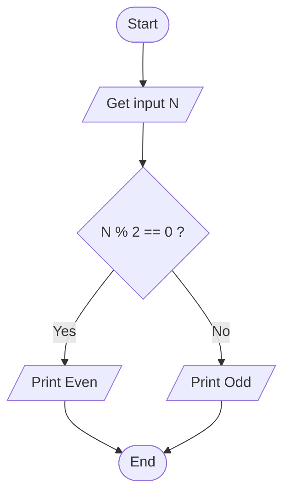
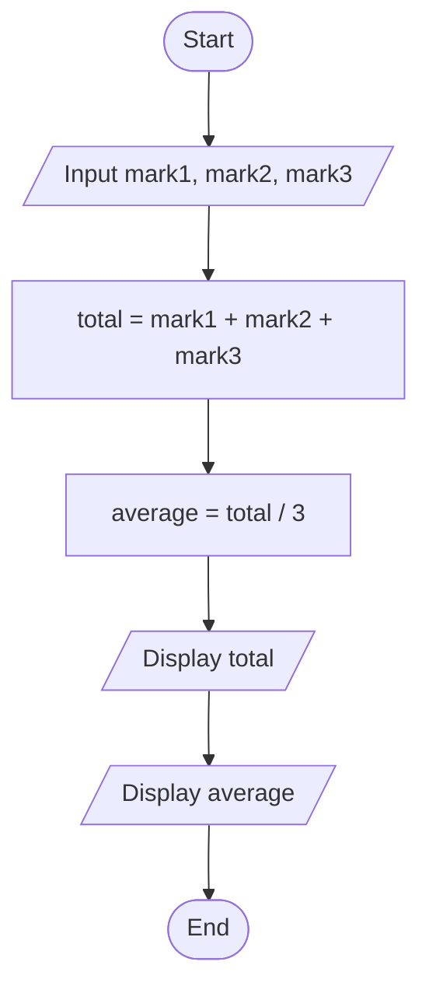
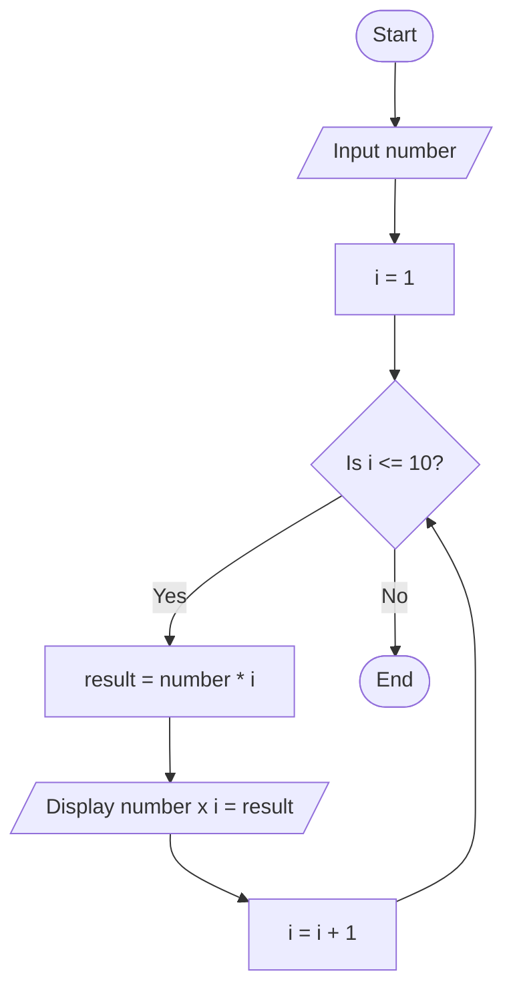
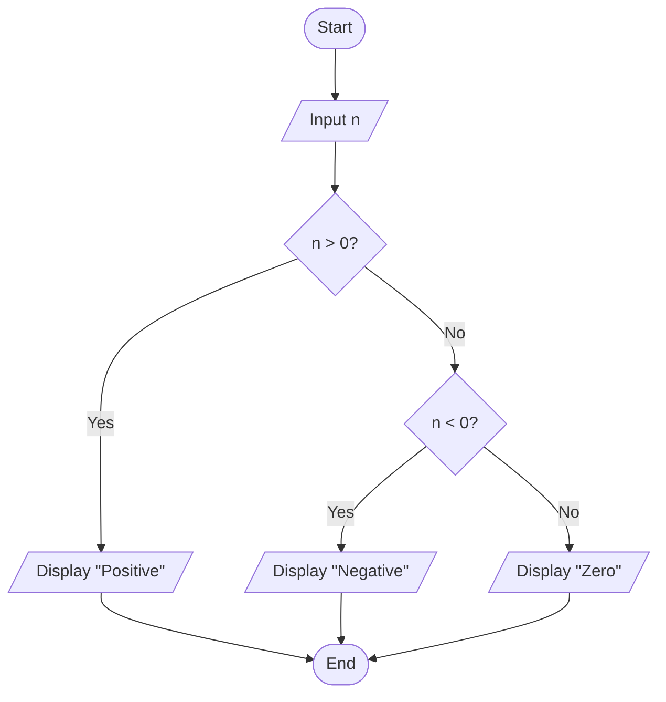
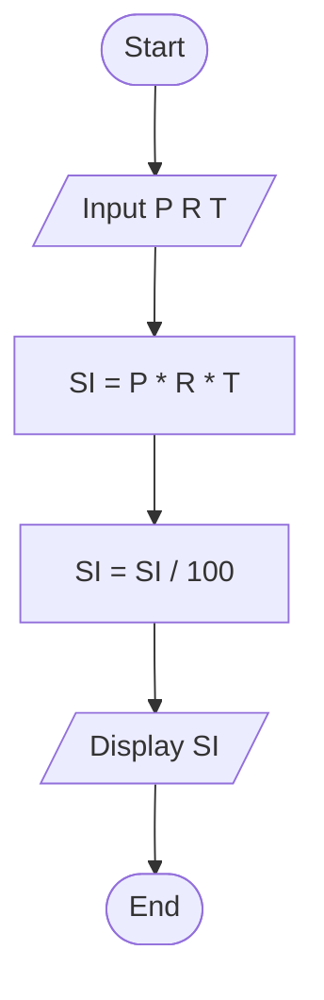
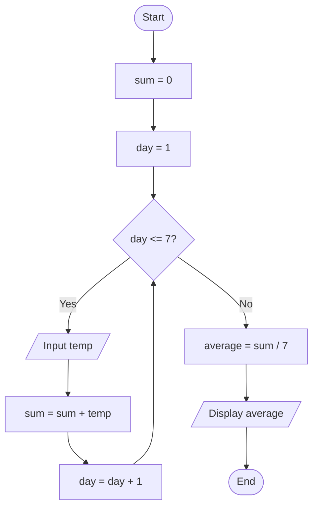
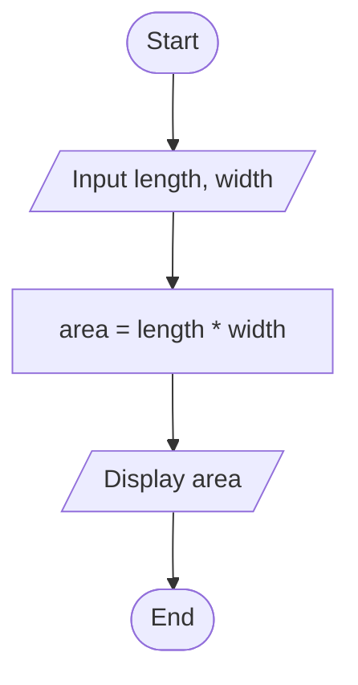
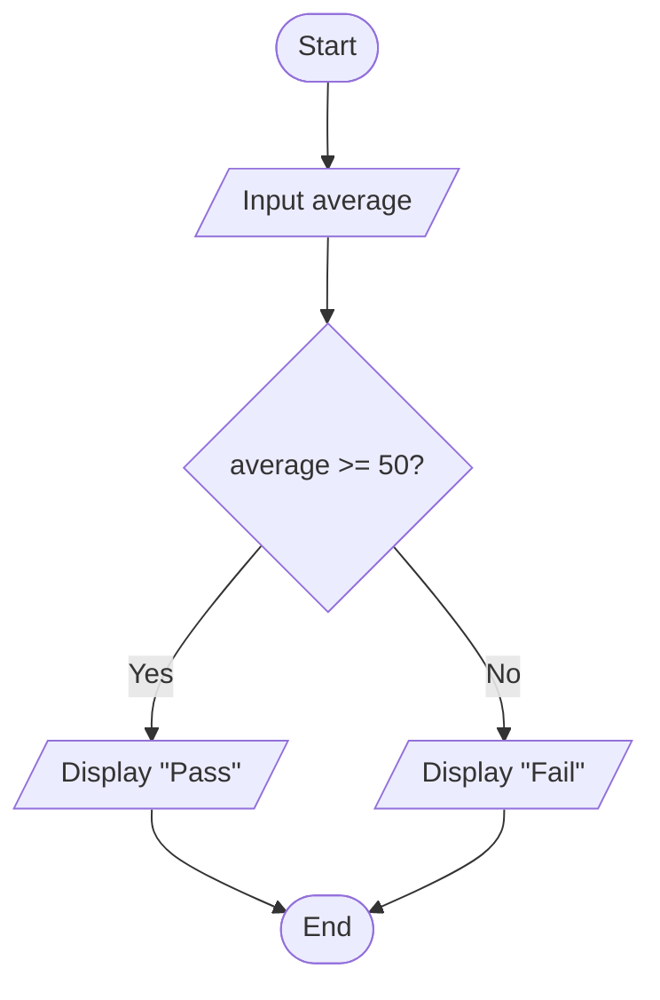
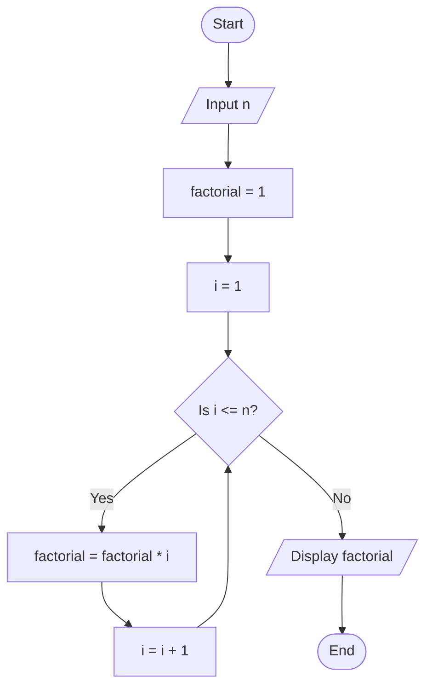
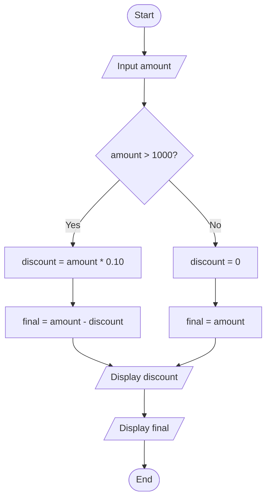

# Workshop: Algorithm and Flowchart
For each question in this workshop, you must complete **two** things:

1.  **Write the pseudocode**
2.  **Draw the flowchart** using either
    - **Option 1:** Draw.io (recommended) → export image → upload to
      your repository → link it in this file
    - **Option 2 (optional):** Write a Mermaid flowchart directly in
      Markdown
    - **Option 3 (optional):** Any other valid method

👉 **IMPORTANT:** At the **bottom of each question**, add the
following sections:

### ✔ Pseudocode

### ✔ Flowchart

---

## 1. Check Even or Odd Number

Design an algorithm and flowchart that take a number as input and
determine whether it is even or odd.

### ✔ Pseudocode

```text
START
    INPUT number
    IF number % 2 == 0 THEN
        PRINT Even
    ELSE
        PRINT Odd
    ENDIF
END
```

### ✔ Flowchart




## 2. Calculate Total and Average Marks

Write the algorithm and draw the flowchart for a program that inputs
marks for 3 subjects, calculates the total and average, and displays
both.

### ✔ Pseudocode

```text
Start

Input mark1, mark2, mark3

total ← mark1 + mark2 + mark3

average ← total / 3

Display total

Display average

End
```
### ✔ Flowchart


## 3. Display Multiplication Table

Create an algorithm and flowchart that input a number and display its
multiplication table from 1 to 10 using a loop.

### ✔ Pseudocode

```text
Start

Input number

For i ← 1 to 10

result ← number × i

Display "number × i = result"

End For

End

```
### ✔ Flowchart


## 4. Positive, Negative, or Zero Check

Write the algorithm and flowchart to input a number and display whether
it is positive, negative, or zero.

### ✔ Pseudocode

```text
Start

Input n

If n > 0 then

Display "Positive"

Else if n < 0 then

Display "Negative"

Else

Display "Zero"

End If

End

```
### ✔ Flowchart


## 5. Simple Interest Calculator

Create an algorithm and flowchart for a program that calculates simple
interest using the formula:

**SI = (P × R × T) / 100**

- **P = Principal** → original amount of money
- **R = Rate of Interest** → percentage per year
- **T = Time** → number of years

### ✔ Pseudocode

```text
Start

Input P, R, T

SI ← (P × R × T) / 100

Display SI

End

```
### ✔ Flowchart



## 6. Average Temperature Calculation

Write the algorithm and draw the flowchart for a program that takes the
temperature of 7 days, finds the average temperature, and displays it.

### ✔ Pseudocode

```text
Start

sum ← 0

For day ← 1 to 7

Input temp

sum ← sum + temp

End For

average ← sum / 7

Display average

End

```
### ✔ Flowchart


## 7. Calculate Area of a Rectangle

Create an algorithm and flowchart to input length and width, calculate
the area (**Area = Length × Width**), and display the result.

### ✔ Pseudocode

```text
Start

Input length, width

area ← length × width

Display area

End


```
### ✔ Flowchart


## 8. Determine Pass or Fail

Write the algorithm and draw the flowchart for a program that takes a
student's average marks and displays **"Pass"** if average ≥ 50,
otherwise **"Fail"**.

### ✔ Pseudocode
```text
Start

Input average

If average ≥ 50 then

Display "Pass"

Else

Display "Fail"

End If

End

```
### ✔ Flowchart


## 9. Calculate Factorial of a Number

Write the algorithm and draw the flowchart that input a number and
calculate its factorial using a loop.

### ✔ Pseudocode

```text
Start

Input n

factorial ← 1

i ← 1

While i ≤ n

factorial ← factorial × i

i ← i + 1

End While

Display factorial

End

```
### ✔ Flowchart

## 10. Calculate Discount on Purchase

Write the algorithm and draw the flowchart for a program that inputs the
purchase amount and gives a **10% discount** if the amount is greater
than 1000.

### ✔ Pseudocode

```text
Start

Input amount

If amount > 1000 then

discount ← amount × 0.10

final ← amount − discount

Else

discount ← 0

final ← amount

End If

Display discount

Display final

End

```
### ✔ Flowchart
